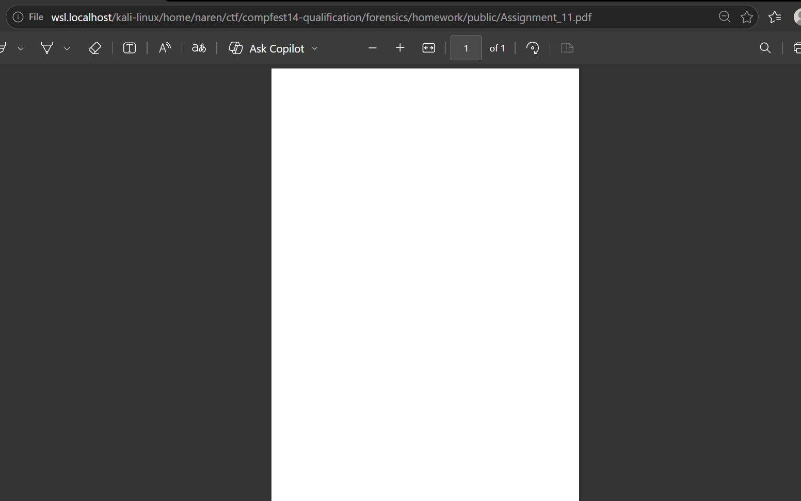

# homework

---

#### 📋 **Challenge Description**

---

- **Category : Forensics**
- **Difficulty : Medium**
- **Hint 1 : both images is "similar" in some way, maybe you could use it as a reference**

Felix is a student from University of Indonesia. He's having problems with his assignment document. He said that the document only contains two images and he forgot the password to open it, would you please help him?

---

**Step 1 : Extract File**

Diberikan file `Assignment_11.zip` yang memiliki password, di sini kita coba crack password dari file tersebut menggunakan wordlists Indonesia (Karena Felix adalah mahasiswa dari Universitas Indonesia).

```bash
zip2john Assignment_11.zip > hash.txt
```

```bash
john --wordlist=/usr/share/wordlists/indonesian-wordlist/00-indonesian-wordlist.lst hash.txt
```

Setelah kita crack, kita akan mendapat password dari file tersebut yaitu **“waktu”,** langsung saja kita ekstrak file tersebut menggunakan password yang baru saja kita crack.

Setelah kita ekstrak kita akan mendapat file `assignment_11.pdf` 

---

**Step 2 : Analisa File pdf**

Kita coba buka dulu file pdf-nya.



file PDF tersebut hanya menampilkan background putih kosong,di mana dari deskripsi chall seharusnya file PDF ini menampilkan 2 gambar. Kita coba cek error yang ada file PDF ini menggunakan tools `pdfsh` 

```bash
Welcome to the PDF shell (Origami release 2.1.0) [OpenSSL: yes, JavaScript: no]

>>> PDF.read("Assignment_11.pdf")
[info ] ...Reading header...
[info ] ...Parsing revision 1...
[error] Breaking on: "==========..." at offset 0x7da7
[error] Last exception: [Origami::InvalidObjectError] Object shall begin with '%d %d obj' statement
[error] Breaking on: "==========..." at offset 0xb57d
[error] Last exception: [Origami::InvalidObjectError] Object shall begin with '%d %d obj' statement
[error] Breaking on: "stream\nx\x9C\xED..." at offset 0xb5c0
[error] Last exception: [Origami::InvalidObjectError] Cannot determine object (no:6,gen:0) type
[info ] ...Parsing xref table...
[info ] ...Parsing trailer...
[info ] ...Propagating types...

---------- Header ----------
  [+] Version: 1.4
----------  Body  ----------
   1 0 R  Metadata
   3 0 R  Dictionary
   4 0 R  ImageXObject
   5 0 R  ImageXObject
   7 0 R  ContentStream
   2 0 R  Page
   8 0 R  PageTreeNode
   9 0 R  Catalog
---------- Trailer ---------
  [*] /Size: 10
  [*] /Root: 9 0 R
  [*] /Info: 1 0 R
  [+] startxref: 50033
```

Ternyata terdapat 3 error pada offset `0x7da7`, `0xb57d`, dan `0xb5c0` .

Di mana error pada offset `0x7da7` dan `0xb57d` disebabkan karena terdapat string “=====”.

Lalu error pada offset `0xb5c0` disebabkan karena object nomor 6 tidak dapat ditentukan.

---

**Step 3 : Analisa Error Yang Terjadi**

Kita coba dulu analisa error yang disebabkan karena terdapat string “=====”, kita coba cari string “====” di hex yang ada di dalam file pdf tersebut.


Terlihat string di tengah “====” yang menunjukkan sebuah petunjuk seperti **Width 510** dan **Remove Mask.** Kita coba cari lagi string “===” barangkali ada petunjuk lagi.

```bash
strings Assignment_11.pdf | grep "===="
```

Output :

```bash
==========Width 510==========
==========Remove Mask==========
==========Height 100==========
==========Use RGB==========
```

---

**Step 4 : Analisa Error menggunakan PDFStream Dumper**

Selanjutnya kita analisa stream dari PDF menggunakan PDFStream Dumper.


Di sini ketahuan bahwa XObject nomor 4 merujuk pada object nomor 4 dan X0bject nomor 6 merujuk pada object nomor 6 (Di mana salah satu isi dari XObject adalah gambar).

Kita coba cek object nomor 4 dan object nomor 6.


Berdasarkan streamnya, object nomor 4 tipenya adalah gambar dan ini sudah sesuai dengan XObject nomor 4.


Pada stream object nomor 6, streamnya tidak sesuai dengan stream yang ada pada object nomor 4.

Berdasarkan deskripsi dan clue yang diberikan, file pdf ini berisi 2 gambar dan kedua gambar tersebut memiliki kemiripan dan kita bisa menggunakan kemiripan tersebut sebagai refrensi. Jadi dapat disimpulkan kita bisa menggunakan stream dari object nomor 4 untuk memperbaiki stream dari object nomor 6.

---

**Step 5 : Ubah Stream Object Nomor 6**


Kita select all stream dari object nomor 4 lalu paste ke stream object nomor 6.


Setelah kita modifikasi, kita buka file pdfnya.


Sudah ada logo COMPFEST tapi masih belum menunjukkan clue/flag. Dan kita tadi diberi clue.

```bash
==========Width 510==========
==========Remove Mask==========
==========Height 100==========
==========Use RGB==========
```

Jadi langsung saja kita sedikit ubah streamnya agar sesuai clue di atas.


Widthnya kita ubah menjadi 510, heightnya kita ubah jadi 100, masknya kita hapus, dan kita ganti dari DeviceGray menjadi DeviceRGB.


Setelah kita modifikasi sedikit, kita akan mendapatkan flag!

**`COMPFESTI _1t_F31ix_ 2ee854bOd6}`**